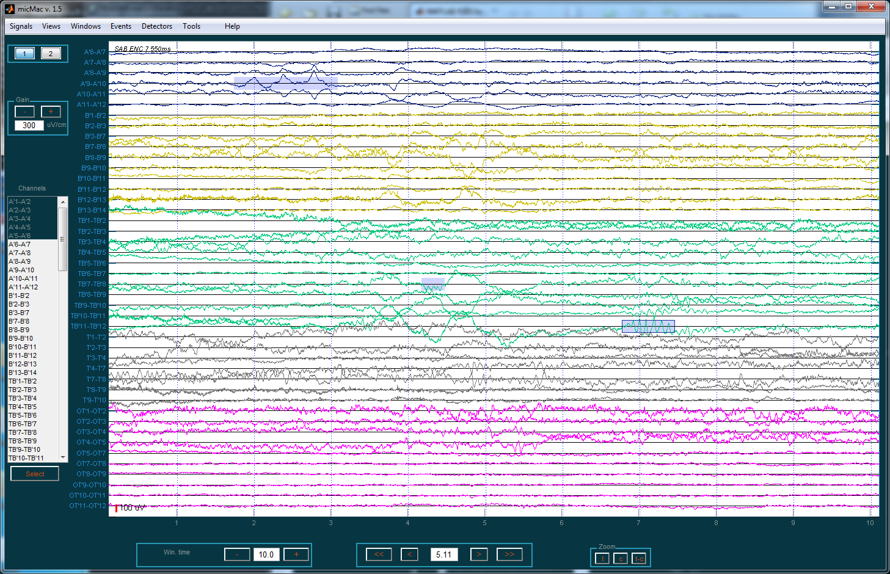

# micMac : Explore your micro-Macro iEEG data 

**micMac** was designed to visualize and analyse intracerebral recordings.
**micMac** handles micro- and Macro- recordings and is helpful for visualizing signals recorded by hybrids electrodes.

Author : Martin Deudon

# Documentation
The documentation is here : [doc](http://micmac.readthedocs.io/en/latest/)

# Installation

- Install [EEGLAB](https://sccn.ucsd.edu/eeglab/download.php) and it to the MATLAB path.
- Install the Biosig toolbox from EEGLAB
- Download *micmac*
- Add *micmac* to the MATLAB path  

# Screenshots

## Global view

## Detail view

